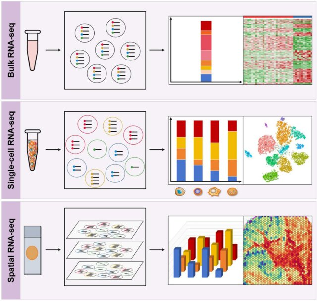
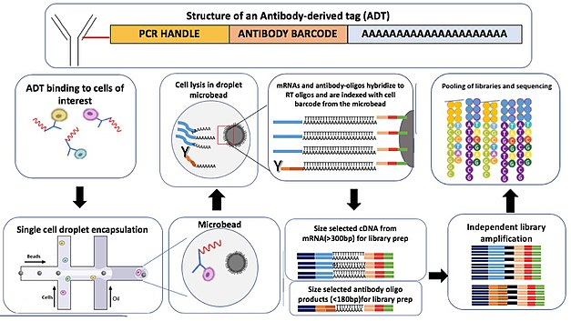
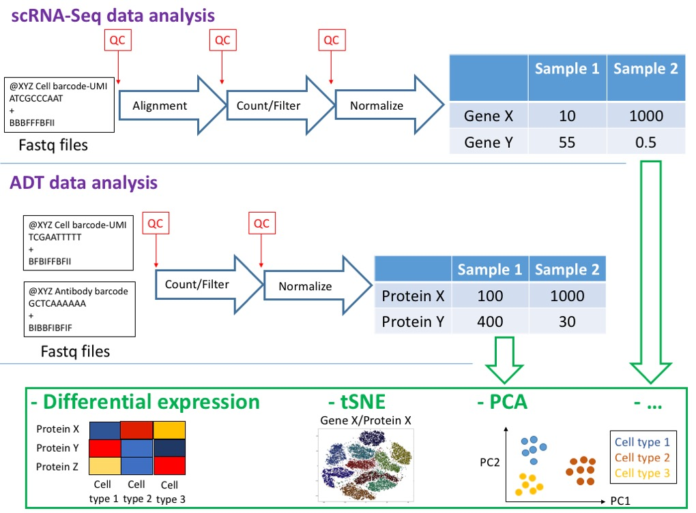

# Repaso: scRNA-seq vs bulk-RNA-seq

- **Bulk RNA-seq:** mide expresión promedio en un tejido; útil para detectar cambios globales, pero oculta heterogeneidad celular.

  - **Insuficiente para:** estudios de desarrollo temprano o tejidos complejos como el cerebro.

[{fig-align="center"}](https://www.ijbs.com/v20p2151.htm)

## Single cell RNA-seq ([scRNA-seq]{.text-blue})

- Primera publicación en 2009 ([Tang *et al*, 2009](https://www.nature.com/articles/nmeth.1315))
- Popularidad en [2014](https://www.nature.com/articles/nmeth.2801)
- Estimar la distribución de los **niveles de expresión de cada gen en una población celular**.
- Análisis a **nivel de célula individual**
- Permite revelar **tipos celulares** (poblaciones raras)
- Analizar las **dinámicas temporales y heterogeneidad**.

## Heterogeneidad: Diversidad interna de un sistema o de un conjunto

- 🔬 **No todas las células son iguales:** incluso dentro de un mismo tejido, existen diferencias en *tipos celulares, estados funcionales y niveles de expresión génica*.

- 🧬 **Variabilidad genética y transcriptómica:** cada célula puede expresar distintos genes o cantidades de RNA, reflejando funciones específicas.

- 🩺 **Relevancia en enfermedad:** la heterogeneidad celular explica por qué un tumor, por ejemplo, contiene subpoblaciones con distintos comportamientos (algunas más agresivas, otras más sensibles a tratamiento).

Visualización a través de **UMAP** (Uniform Manifold Approximation and Projection):

[{fig-align="center"}](https://biostatsquid.com/umap-simply-explained/)

## **Preguntas que se pueden responde scRNA-seq**

- Descubrir **tipos celulares nuevos o raros**.
- Identificar **composición celular diferencial** entre sano vs. enfermo.
- Comprender la **diferenciación celular** en desarrollo y regeneración.
- Analizar **plasticidad y dinámicas de expresión** en células individuales.
- Construir **atlas celulares/genéticos** → catálogo completo de diversidad celular.
- Aplicaciones en **investigación básica y medicina personalizada**.

{alt="Image source: Kageyama, et al. 2018. Front. Neurosci" fig-align="center"}

## General Pipeline for scRNA‑seq with Seurat

+----------------------------------+----------------------------------------------------------------------+----------------------------------------------------------+
| **Step**                         | **Purpose**                                                          | **Seurat Command**                                       |
+==================================+======================================================================+==========================================================+
| 1.  **Preprocessing**            | Load raw count matrix and create Seurat object                       | `Read10X()`, `CreateSeuratObject()`                      |
+----------------------------------+----------------------------------------------------------------------+----------------------------------------------------------+
| 2.  **Quality Control (QC)**     | Filter cells/genes based on metrics (e.g., nFeature_RNA, percent.mt) | `subset()`, `PercentageFeatureSet()`                     |
+----------------------------------+----------------------------------------------------------------------+----------------------------------------------------------+
| 3.  **Normalization**            | Adjust counts for sequencing depth                                   | `NormalizeData()` or `SCTransform()`                     |
+----------------------------------+----------------------------------------------------------------------+----------------------------------------------------------+
| 4.  **Feature Selection**        | Identify variable genes                                              | `FindVariableFeatures()`                                 |
+----------------------------------+----------------------------------------------------------------------+----------------------------------------------------------+
| 5.  **Dimensionality Reduction** | Reduce dimensions for visualization                                  | `ScaleData()`, `RunPCA()`, `RunUMAP()`, `RunTSNE()`      |
+----------------------------------+----------------------------------------------------------------------+----------------------------------------------------------+
| 6.  **Clustering & Annotation**  | Group cells and assign biological meaning                            | `FindNeighbors()`, `FindClusters()`, `FindAllMarkers()`  |
+----------------------------------+----------------------------------------------------------------------+----------------------------------------------------------+
| 7.  **Dataset Integration**      | Combine multiple datasets, remove batch effects                      | `FindIntegrationAnchors()`, `IntegrateData()`            |
+----------------------------------+----------------------------------------------------------------------+----------------------------------------------------------+
| 8.  **Downstream Analysis**      | Specific goals: DEGs, trajectories, cell communication               | `FindMarkers()`, `CellCycleScoring()`, external packages |
+----------------------------------+----------------------------------------------------------------------+----------------------------------------------------------+

## Variations of scRNA‑seq

+-----------------------------------------------+------------------------------------------------+
| **Type of Analysis**                          | **Contribution**                               |
+===============================================+================================================+
| **Unimodal (RNA only)**                       | Cellular heterogeneity in gene expression      |
+-----------------------------------------------+------------------------------------------------+
| **Multimodal (RNA + others, e.g., CITE‑seq)** | Regulation, proteomics, and biological context |
+-----------------------------------------------+------------------------------------------------+
| **Trajectories**                              | Temporal dynamics of biological processes      |
+-----------------------------------------------+------------------------------------------------+
| **Cellular Interactions**                     | Communication and functional networks          |
+-----------------------------------------------+------------------------------------------------+
| **Dataset Integration**                       | Comparison across conditions                   |
+-----------------------------------------------+------------------------------------------------+

## What is CITE-Seq?

CITE‑seq (**Cellular Indexing of Transcriptomes and Epitopes by Sequencing**) is a **multimodal single‑cell technique** that combines RNA sequencing with protein profiling at the level of individual cells.

### 📌 Key points about CITE‑seq

- **Simultaneous measurements** → captures both the **transcriptome (scRNA‑seq)** and **surface proteins** using antibody‑derived tags (ADTs).
- **Highly multiplexed** → allows detection of many protein markers in parallel, alongside unbiased RNA profiling.
- **Single‑cell resolution** → thousands of cells can be analyzed at once, integrating RNA and protein data.
- **Multimodal context** → CITE‑seq is part of the broader **multimodal analysis** frontier in single‑cell genomics, where multiple data types (RNA, ATAC, methylation, perturbations) are measured in the same cell.
- **Applications** → improves cell type identification, refines clustering, and reveals functional states that RNA alone might miss.

{alt="Schematic figure of (A) the CITE-seq antibody linked with the barcoded oligo (B) the CITE-seq protocol. Credit: Winston & Gregory Timp (2020), license: CC-BY 4.0" fig-align="center"}

## Overview

{alt="Schematic of the dry lab workflow for CITE-Seq"}

## General Pipeline for CITE‑seq

+----------------------------------+-----------------------------------------------------------+-----------------------------------------------------------------+
| **Step**                         | **Purpose**                                               | **Seurat Command**                                              |
+==================================+===========================================================+=================================================================+
| 1.  **Preprocessing**            | Load RNA counts and antibody‑derived tags (ADT)           | `Read10X()`, `CreateSeuratObject()`                             |
+----------------------------------+-----------------------------------------------------------+-----------------------------------------------------------------+
| 2.  **Quality Control (QC)**     | Filter cells/genes based on RNA metrics and ADT counts    | `PercentageFeatureSet()`, `subset()`                            |
+----------------------------------+-----------------------------------------------------------+-----------------------------------------------------------------+
| 3.  **Normalization (RNA)**      | Adjust RNA counts for sequencing depth                    | `SCTransform()` or `NormalizeData()`                            |
+----------------------------------+-----------------------------------------------------------+-----------------------------------------------------------------+
| 4.  **Normalization (ADT)**      | Center and scale protein counts                           | `NormalizeData(assay = "ADT")`, `ScaleData(assay = "ADT")`      |
+----------------------------------+-----------------------------------------------------------+-----------------------------------------------------------------+
| 5.  **Feature Selection (RNA)**  | Identify variable genes                                   | `FindVariableFeatures()`                                        |
+----------------------------------+-----------------------------------------------------------+-----------------------------------------------------------------+
| 6.  **Dimensionality Reduction** | Reduce dimensions for RNA and ADT separately              | `RunPCA(assay = "RNA")`, `RunPCA(assay = "ADT")`                |
+----------------------------------+-----------------------------------------------------------+-----------------------------------------------------------------+
| 7.  **Multimodal Integration**   | Combine RNA + ADT signals                                 | `FindMultiModalNeighbors()`, `RunUMAP(nn.name = "weighted.nn")` |
+----------------------------------+-----------------------------------------------------------+-----------------------------------------------------------------+
| 8.  **Clustering & Annotation**  | Group cells and assign biological meaning                 | `FindClusters()`, `FindAllMarkers()`                            |
+----------------------------------+-----------------------------------------------------------+-----------------------------------------------------------------+
| 9.  **Downstream Analysis**      | Discover enriched proteins per cluster, refine cell types | `FindMarkers(assay = "ADT")`, external multimodal workflows     |
+----------------------------------+-----------------------------------------------------------+-----------------------------------------------------------------+

## scRNA-seq vs scRNA-seq + CITE‑seq

+---------------+---------------------------------+----------------------------------------------------------------------------------------------------------------------------------------------+
| **Approach**  | **Type**                        | **Purpose**                                                                                                                                  |
+===============+=================================+==============================================================================================================================================+
| **scRNA‑seq** | **Unimodal (RNA only)**         | Characterize **transcriptomic heterogeneity**: identify cell types, states, and gene expression dynamics based solely on RNA.                |
+---------------+---------------------------------+----------------------------------------------------------------------------------------------------------------------------------------------+
| **CITE‑seq**  | **Multimodal (RNA + proteins)** | Integrate **RNA + surface proteins**: refine cell type annotation, validate clusters, and capture functional context beyond transcriptomics. |
+---------------+---------------------------------+----------------------------------------------------------------------------------------------------------------------------------------------+

## Referencias

- [Cite-seq-Count](https://hoohm.github.io/CITE-seq-Count/)
- [CITE-Seq tutorial](https://broadinstitute.github.io/2020_scWorkshop/cite-seq.html)
- [End-to-end CITE-seq analysis workflow using dsb for ADT normalization and Seurat for multimodal clustering](https://cran.r-project.org/web/packages/dsb/vignettes/end_to_end_workflow.html)
- [Using Seurat with multimodal data](https://satijalab.org/seurat/articles/multimodal_vignette)
- [Simultaneous epitope and transcriptome measurement in single cells](https://www.nature.com/articles/nmeth.4380)
- [Introducción a scRNA-seq y control de calidad](https://eveliacoss.github.io/Workshop_scRNAseq_presentacion/Clase1_Intro_QC.html#1)
- [Workshop de scRNA-seq](https://github.com/EveliaCoss/Workshop_scRNAseq_presentacion)
