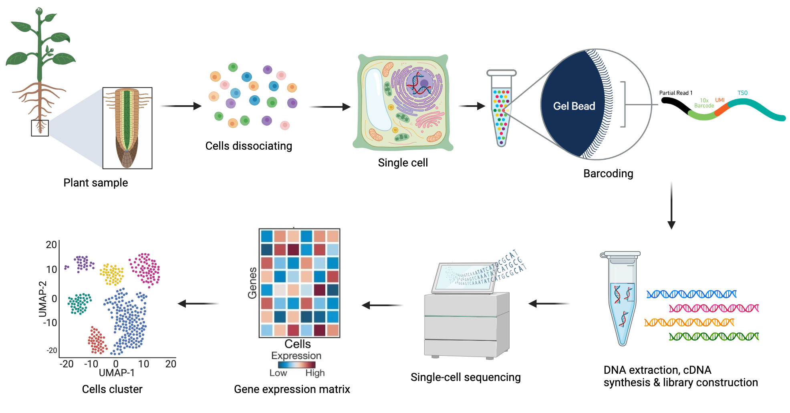

# Repaso: scRNA-seq vs bulk-RNA-seq

- **Bulk RNA-seq:** mide expresión promedio en un tejido; útil para detectar cambios globales, pero oculta heterogeneidad celular.

  - **Insuficiente para:** estudios de desarrollo temprano o tejidos complejos como el cerebro.

[{fig-align="center"}](https://www.ijbs.com/v20p2151.htm)

## **Single cell RNA-seq (scRNA-seq)**

- Primera publicación en 2009 ([Tang *et al*, 2009](https://www.nature.com/articles/nmeth.1315))
- Popularidad en [2014](https://www.nature.com/articles/nmeth.2801)
- Estimar la distribución de los **niveles de expresión de cada gen en una población celular**.
- Análisis a **nivel de célula individual**
- Permite revelar **tipos celulares** (poblaciones raras)
- Analizar las **dinámicas temporales y heterogeneidad**.

## **Heterogeneidad: Diversidad interna de un sistema o de un conjunto**

- 🔬 **No todas las células son iguales:** incluso dentro de un mismo tejido, existen diferencias en *tipos celulares, estados funcionales y niveles de expresión génica*.

- 🧬 **Variabilidad genética y transcriptómica:** cada célula puede expresar distintos genes o cantidades de RNA, reflejando funciones específicas.

- 🩺 **Relevancia en enfermedad:** la heterogeneidad celular explica por qué un tumor, por ejemplo, contiene subpoblaciones con distintos comportamientos (algunas más agresivas, otras más sensibles a tratamiento).

Visualización a través de **UMAP** (Uniform Manifold Approximation and Projection):

[{fig-align="center"}](https://biostatsquid.com/umap-simply-explained/)

## **Preguntas que se pueden responde scRNA-seq**

- Descubrir **tipos celulares nuevos o raros**.
- Identificar **composición celular diferencial** entre sano vs. enfermo.
- Comprender la **diferenciación celular** en desarrollo y regeneración.
- Analizar **plasticidad y dinámicas de expresión** en células individuales.
- Construir **atlas celulares/genéticos** → catálogo completo de diversidad celular.
- Aplicaciones en **investigación básica y medicina personalizada**.

[{fig-align="center"}](Imagen%20tomada%20de:%20Kageyama,%20et%20al.%202018.%20Front.%20Neurosci)

## **Flujo experimental de scRNA-Seq**

## Referencias
