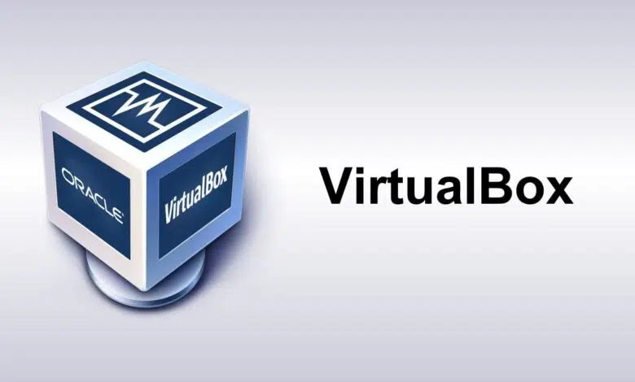

# VirtualBox Setup and Usage

A virtual **machine (VB, VirtualBox)** is a simulated environment that works like a “computer inside your computer.”

{fig-align="center"}

## 🖥️ What is a VB?

- **Virtual machine**: software that mimics a complete operating system using the host computer’s resources (RAM, CPU, disk).
- It runs inside a program called a **hypervisor** (e.g., VirtualBox, VMware).

## 📌 When is it used?

- **Testing operating systems** without affecting your main PC.
- **Software development and testing** in isolated environments.
- **Running legacy software** that no longer works on modern systems.
- **Security**: analyzing suspicious files without risk.
- **Education**: teaching system installation and configuration.

## Steps to Set Up VirtualBox

1.  **Install VirtualBox**
    - Download VirtualBox from Oracle’s official website.
    - Run the installer and follow the instructions.
    - Restart your computer if necessary.
2.  **Create a new virtual machine**
    - Open VirtualBox and select **New**.
    - Assign a name and choose the operating system to install.
    - Define the amount of RAM to allocate.
3.  **Configure storage**
    - Create a virtual hard disk (VDI recommended).
    - Choose dynamic or fixed size depending on your needs.
    - Set the disk space (e.g., 20 GB or more).
4.  **Mount the operating system**
    - In the VM settings, go to **Storage**.
    - Add the ISO image of the operating system.
    - Save the changes.
5.  **Start the virtual machine**
    - Click **Start**.
    - The operating system will boot from the ISO.
    - Proceed with installation as if it were a physical computer.
6.  **Install Guest Additions (optional but recommended)**
    - Once the OS is installed, in the VirtualBox menu select: **Devices → Insert Guest Additions CD image**.
    - Install the add-ons to improve performance and compatibility.
