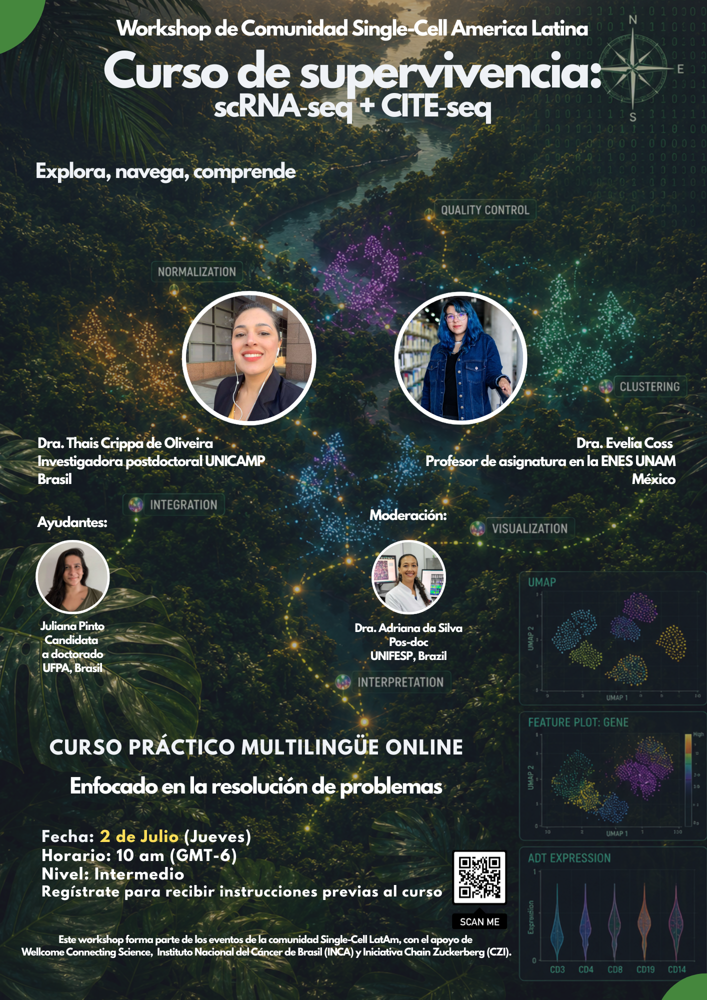

# Información general {.unnumbered}

:::: {.panel-tabset group="globalInfo"}
## Sobre el curso 📌

::: {style="text-align: center;"}
**Curso práctico multilingüe en línea**

[**Enfoque en la resolución de problemas**]{.text-blue}
:::

- **Fecha**: **2 de julio de 2026 (jueves)**
- **Conversión de horario:**
  - **Ciudad de México, México**

    - Zona horaria: GMT‑6

    - Hora: **10:00 AM**

  - **Brasilia, Brasil**

    - Zona horaria: GMT‑3

    - Hora equivalente: **01:00 PM**
- **Duración**: **3 horas**
- **Nivel**: **Intermedio**
- **Regístrate para recibir las instrucciones previas al curso:** [Google form](https://docs.google.com/forms/d/e/1FAIpQLSefUomOjP_j8vjOcPbGMwq9MNDOYB0zIHfEV_WMBqhmFxTelQ/viewform)

#### **Instructoras:**

- **Thais Crippa de Oliveira, PhD** - Investigadora posdoctoral en UNICAMP, Brasil
- **Evelia Lorena Coss-Navarrete, PhD** - Profesora asociada en ENES, Juriquilla-UNAM, México. [Página web](https://eveliacoss.github.io/)

Ayudantes:

- **Juliana Pinto** - Estudiante de doctorado, UFPA, Brasil
- **Adriana da Silva, PhD** - Investigadora posdoctoral en UNIFESP, Brasil

### 🎯 Objetivo general

Permitir que los participantes naveguen en un conjunto de datos multimodal (**RNA + ADT**), realicen el preprocesamiento esencial e interpreten resultados básicos sin perderse en los detalles técnicos.

### ✅ Resultados esperados

- Confianza para abrir y explorar datos multimodales.
- Capacidad para ejecutar un pipeline básico en **Seurat**.
- Comprensión de cómo los **ADT** complementan al **RNA**.
- Conocimiento de las preguntas de investigación y limitaciones en **CITE‑seq**.

{fig-align="center" width="405"}

### Citar y reutilizar el material del curso

Los datos del curso pueden reutilizarse y adaptarse libremente con la debida atribución. Todos los datos de estos repositorios están sujetos a la licencia [Attribution-NonCommercial-ShareAlike 4.0 International (CC BY-NC-SA 4.0)](https://creativecommons.org/licenses/by-nc-sa/4.0/).

## Requisitos previos para el curso

- Verifica que todos los paquetes requeridos de **R** estén instalados, siguiendo las instrucciones proporcionadas en [Get ready for the workshop](scripts/scSurvival_PreCourse_Setup.html).
- Asegúrate de tener **Git, R, RStudio y Bash** correctamente instalados y funcionando en tu computadora.
- Confirma que tienes acceso a una **conexión a internet estable** para la sincronización de repositorios y la descarga de paquetes.

## Agenda 📆

| Tema                                             | Duración | Instructora  |
|--------------------------------------------------|----------|--------------|
| Repaso: Introducción a scRNA‑seq + CITE‑seq      | 30 min   | Evelia Coss  |
| Configuración y uso de **VirtualBox**            | 20 min   | Thais Crippa |
| 🎮 **Kahoot Quiz: Introducción + Configuración** | 10 min   | Both         |
| scRNA‑seq — Errores y supervivencia              | 50 min   | Thais Crippa |
| 🎮 **Kahoot Quiz: Fundamentos de scRNA‑seq**     | 10 min   | Thais Crippa |
| CITE‑seq — Errores y supervivencia               | 50 min   | Evelia Coss  |
| 🎮 **Kahoot Quiz: Fundamentos de CITE‑seq**      | 10 min   | Evelia Coss  |
::::
